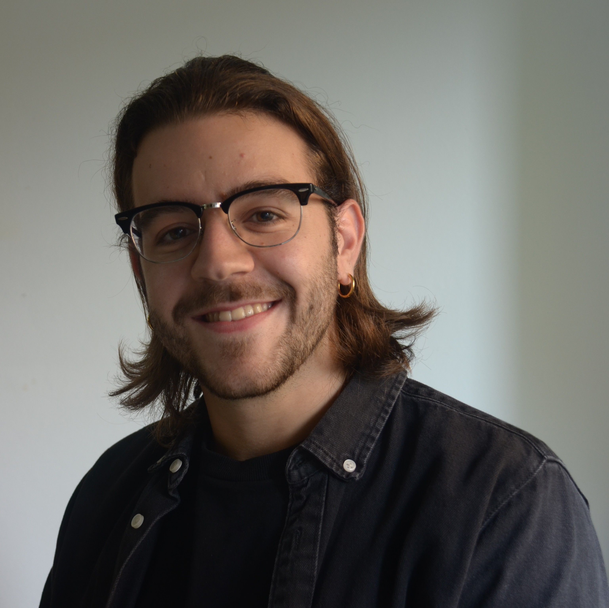

<!-- --- -->
<!-- # layout: default -->
<!-- --- -->
<!--  -->
<!-- ## About Me -->
<!--  -->
<!--  -->
<!--  -->
<!-- Hi! I am a junior year student of B.E. Computer Science at Birla Institute of Technology and Science, Pilani. -->
<!--  -->
<!-- This is a jekyll based resume template. You can find the full source code on [GitHub](https://github.com/bk2dcradle/researcher) -->
<!--  -->
<!-- ## Research Interest -->
<!--  -->
<!-- Lorem ipsum dolor sit amet, consectetur adipiscing elit. Aliquam finibus ipsum ac erat aliquam dapibus. Vestibulum vehicula placerat ex, a consectetur odio pharetra quis. Mauris id urna ante. Fusce pharetra diam ac nisi aliquet, vel egestas ex iaculis. Pellentesque laoreet cursus tellus sed pellentesque. Praesent a rhoncus elit. Nunc ipsum nisl, consequat sit amet pretium quis, gravida id ipsum. -->
<!--  -->
<!-- ## Publications -->
<!--  -->
<!-- 1. F.Bar, J.Doe: Effects of having a placeholder of a name -->
<!-- 2. S.Holmes, J.Watson: Consequences of living with a sociopath in London -->
<!--  -->
<!-- ## Typography -->
<!--  -->
<!-- This is a [link](http://google.com). Something *italics* and something **bold**. -->
<!--  -->
<!-- Here is a table -->
<!--  -->
<!-- Year | Award | Category -->
<!-- -----|-------|-------- -->
<!-- 2014 | Emmy  | Won Outstanding Lead Actor in a miniseries or a movie -->
<!-- 2015 | BAFTA | Nominated for Best Leading Actor for Sherlock -->
<!-- 2014 | Satellite | Won Best Actor miniseries or television film -->
<!--  -->
<!-- Here is a horizontal rule -->
<!--  -->
<!-- --- -->
<!--  -->
<!-- Here is a blockquote -->
<!--  -->
<!-- > To a great mind, nothing is little -->
<!--  -->
<!-- ## References -->
<!--  -->
<!-- * Foo Bar: Head of Department, Placeholder Names, Lorem -->
<!-- * John Doe: Associate Professor, Department of Computer Science, Ipsum -->
<!--  -->

## About me

I am a MSc student at **Politecnico di Torino** in Data Science and Engineering. Currently, I am in Zurich as a visiting student for my Master's thesis at the Integrated Systems Laboratory of **ETH**, working on self-supervised machine learning techniques for seizure prediction on EEG data.

<!-- Previously, I conducted an Intersnhip as a Data Scientist at KPMG Advisory in Turin, collaborating with a top-tier automative company on predictive maintenance and emerging issues forecasting. I have also been a Junior Teaching Assitant of the Data Management and Visualization course helf at Politecnico di Torino. -->

## Formation
- Master’s Thesis @ ETH Zurich (Nov 2022 - present)
- MSc. Data Science and Engineering @ Politecnico di Torino (Sep 2020 - present)
- BSc. Electronic Engineering @ University of Bologna (Sep 2017 - July 2020)

## Experience
<table width="100%" align="center" border="0" cellspacing="20" cellpadding="30">
    <tr>
        <td width="20%" valign="center">
        

            
            

            
 <a href="https://www.cmre.nato.int/" target="_blank">NATO's CMRE</a>  

            
 Research Intern

        

        </td>
        <td width="20%" valign="center">
        

            
            

            
 <a href="http://axti.radboudimaging.nl/index.php/Home" target="_blank">Advanced X-Ray Tomographic Imaging lab</a>  

            
 Research Intern

        

        </td>
        <td width="20%" valign="center">
        

            
            

            
 <a href="https://www.aikospace.com/" target="_blank">AIKO - Infinite Ways to Autonomoy</a>  

            
 Deep Learning Engineer Intern

        

        </td>
    </tr>

</tbody></table>

## Main Projects
- [Real-time Domain Adaptation in Semantic Segmentation](https://github.com/lucabnf/realtime-DA)
- [Edge-Cloud Collaborative Inference for IoT](https://github.com/lucabnf/ml4iot)
- [Drug abuse prediction](https://github.com/lucabnf/drug-consumption)
- [Damage detection on vehicles](https://github.com/lucabnf/damage-detection)